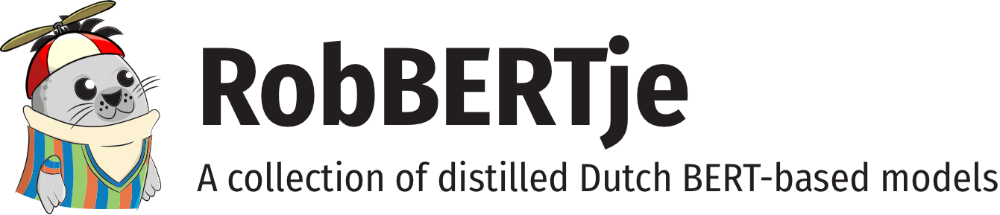

 
    
 

# About RobBERTje
RobBERTje is a collection of distilled models based on [RobBERT](http://github.com/iPieter/robbert). There are multiple models with different sizes and different training settings, which you can choose for your use-case.

We are also continuously working on releasing better-performing models, so watch this page for updates.

# News
- **July 2, 2021**: Publicly released 4 RobBERTje models.
- **May 12, 2021**: RobBERTje was accepted at [CLIN31](https://www.clin31.ugent.be) for an oral presentation!

# The models
| Model        | Description | Parameters | Training size | Huggingface id                                                                     |
|--------------|-------------|------------------|-------------------|------------------------------------------------------------------------------------|
| Non-shuffled | Trained on the non-shuffled variant of the oscar corpus, without any operations to preserve this order during training and distillation.            | 74 M             | 1 GB              | [DTAI-KULeuven/robbertje-1-gb-non-shuffled](https://huggingface.co/DTAI-KULeuven/) |
| Shuffled     | Trained on the publicly available and shuffled OSCAR corpus.            | 74 M             | 1 GB              | [DTAI-KULeuven/robbertje-1-gb-shuffled](https://huggingface.co/DTAI-KULeuven/)     |
| Merged (p=0.5)       | Same as the non-shuffled variant, but sequential sentences of the same document are merged with a probability of 50%.           | 74 M             | 1 GB              | [DTAI-KULeuven/robbertje-1-gb-merged](https://huggingface.co/DTAI-KULeuven/)       |
| BORT         | A smaller version with 8 attention heads instead of 12 and 4 layers instead of 6 (and 12 for RobBERT).            | 46 M             | 1 GB              | [DTAI-KULeuven/robbertje-1-gb-bort](https://huggingface.co/DTAI-KULeuven/)         |

# Recreating our experiments

## Distillation

## Fine-tuning